# Hello Flink 👋


My repository with [Apache Flink](https://flink.apache.org) learnings.

### Quick Start

01 - **Download** user mocked data.

```bash
mkdir -p ./data/raw/users
curl -o "data/raw/users/users.csv" \
  "https://raw.githubusercontent.com/avcaliani/kafka-in-docker/refs/heads/main/scripts/users.csv"
```

02 - Start the containers 🐳

```bash
# 💡 To stop just type `docker compose down`
docker compose up -d
```

> 💡 [Reference](https://nightlies.apache.org/flink/flink-docs-release-2.0/docs/try-flink/local_installation/)

03 - Start **kafka producer** ([ref](https://github.com/avcaliani/kafka-in-docker/tree/main/scripts)) 👇

```bash
docker compose exec kafka-dev /opt/scripts/donu-transactions.sh
```

04 - **Run** the application

```bash
# Pipeline - Dummy
#   Pretty simple pipeline, it just prints the list of customer in a CSV file. 
./run.sh --pipeline "dummy" --bucket "/data"
  
# Pipeline - Validate Transactions
#   Classify the transactions as correct/incorrect, 
#   enrich and forward them to another topic, check the diagram.
./run.sh --pipeline "validate-transactions" \
      --bucket "/data" \
      --kafka-brokers "kafka-dev:29092"
```

#### Pipeline - Validate Transactions 

```mermaid
---
config:
  theme: 'base'
  themeVariables:
    primaryColor: '#f6f8fa'
    primaryTextColor: '#24292f'
    primaryBorderColor: '#d0d7de'
    lineColor: '#0969da'
    secondaryColor: '#afb8c1'
    tertiaryColor: '#ddf4ff'
    background: '#ffffff'
    edgeLabelBackground: '#ffffff'
---
graph LR
  app_txn s01@-->|publishes<br>transactions| q_txn_v1

  q_txn_v1 s02@--> app_flink
  st_user --> app_flink

  app_flink s03@-->|valid data| st_txn
  app_flink s04@-->|invalid data| q_dead_letter

%% ----------------------------------------
%%  Style
%% ----------------------------------------

%% Applications
app_txn@{ shape: rounded, label: "Txn Service" }
app_flink@{ shape: rounded, label: "🐿️ Flink App" }

%% Queues
q_txn_v1@{ shape: das, label: "donu_txn_v1" }
q_dead_letter@{ shape: das, label: "dead_letter"}

%% Storage
st_user@{ shape: disk, label: "users.csv" }
st_txn@{ shape: das, label: "donu_exec_txn_v1" }

%% Animation
s01@{ animate: true }
s02@{ animate: true }
s03@{ animate: true }
s04@{ animate: true }

%% Arrow Colors
linkStyle 3 stroke:#00b894
linkStyle 4 stroke:#d63031
```


